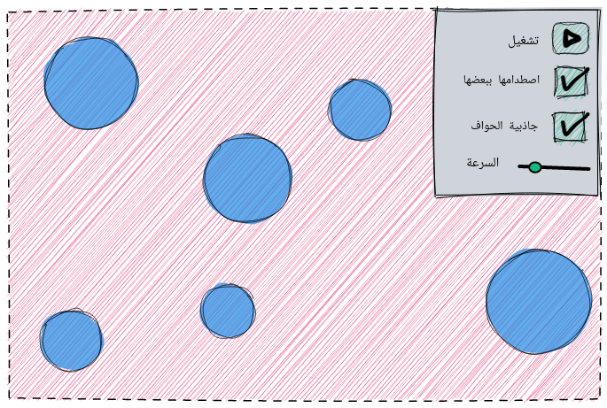

# الكرات الواثبة

مشروع برمجة مطلوب من الكلية تدريبا على ما تعلمناه من الجافا وال javafx

# أمثلة وإلهامات

  1. https://codepen.io/rglazebrook/pen/AMMgVz
  2. https://www.youtube.com/watch?v=x6NFmzQHvMU
  3. https://www.youtube.com/watch?v=YIKRXl3wH8Y
  3. به محتوى متقدم قليلا، ربما يصعب على المبتدئين، لكن يمكنك أن تأخذ من فكرة عن اكتشاف التصادم بين الكرات والاطلاع على عالم رسومات الحاسوب المليئ computer graphics بالمغامرات والإثارة: https://www.youtube.com/watch?v=eED4bSkYCB8

# مخطط الواجهة

# مخطط الفئات Classes Diagram

- هذا المخطط مصمم ببرنامج [draw.io](https://draw.io)، وملف المشروع هو _./bouncing-balls-class-uml.svg_.
- ما هو باللون الأصفر سنأجله مؤقتا (وربما نتخلى عنه)، وهي خاصية اصطدام الكرات ببعضها.

# تقسم المهام

- الواجهة وربطها بالأحداث: App, SpeedSliderHandler, GravitationalEdgesCheckBoxHandler
  - محمود خالد
  - محمد بن أحمد بن نصر
- إنتاج الكرات: BallsGenerator, RandomColor, Ball, Vector
  - مؤمن العطار
  - محمد أشرف
  - محمد سمير الصنافين

- المتحكم: Controller, EdgesController, GravitationalEdgesController
  - محمد تامر
  - محمد ذكي
  - محمد علي عبد المحسن
  - محمد فتحي * 2
